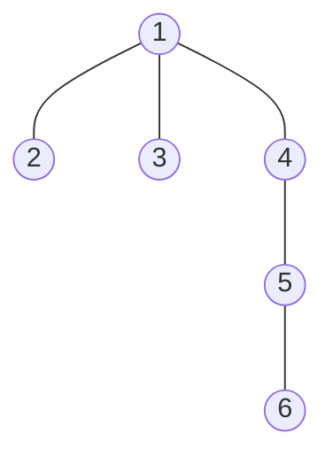
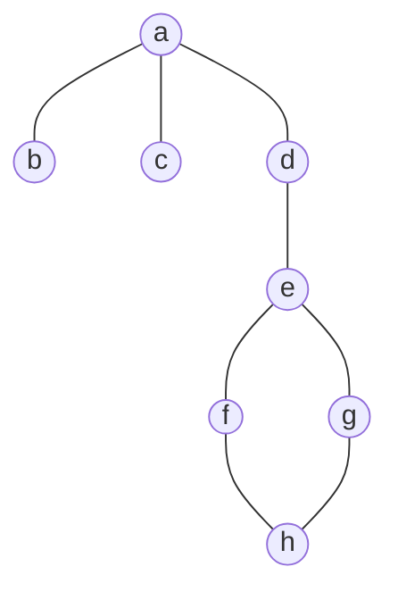
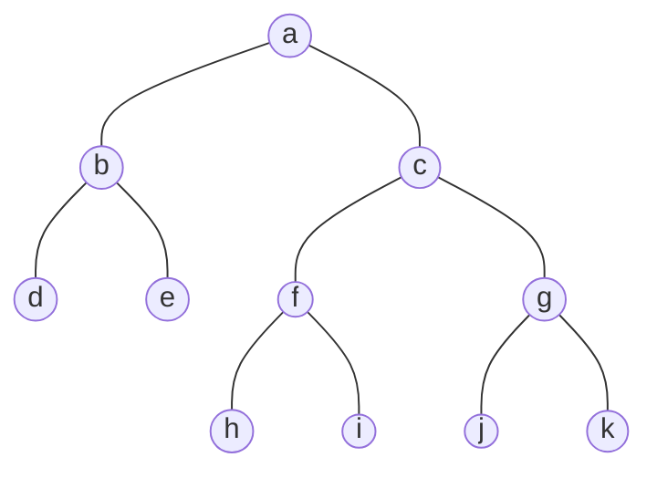
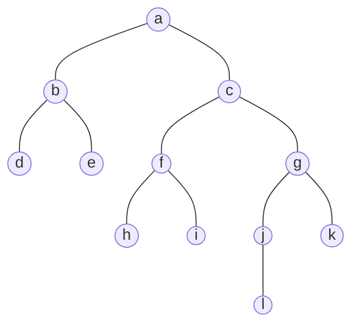

# ForFun Graph Library

## Test graphs

### Graph 1

Six-node tree.

### Graph 2

Eight-node graph with a cycle.

### Graph 3

Balanced twelve-node binary tree.

### Graph 4

Unbalanced twelve-node binary tree.

