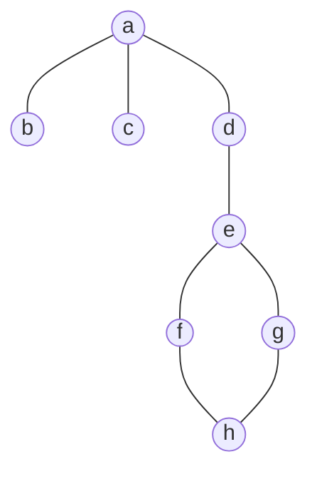

# ForFun Graph Library

## Test graphs

See `test/graph/vertex_test.cpp`

### Graph 1

```mermaid
flowchart TB
    id1((a)) --- id2((b))
    id1 --- id3((c))
    id1 --- id4((d))
    id4 --- id5((e))
    id5 --- id6((f))
    id5 --- id7((g))
    id6 --- id8((h))
    id7 --- id8
```
